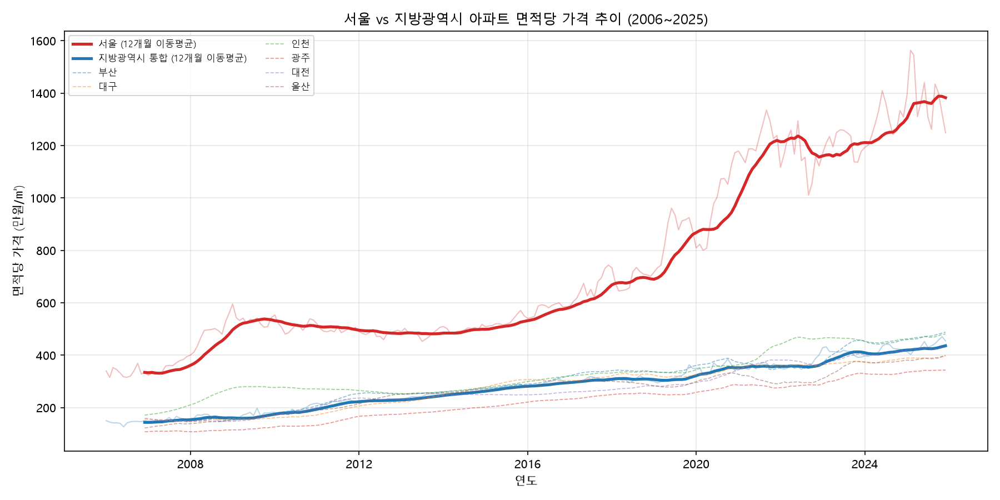
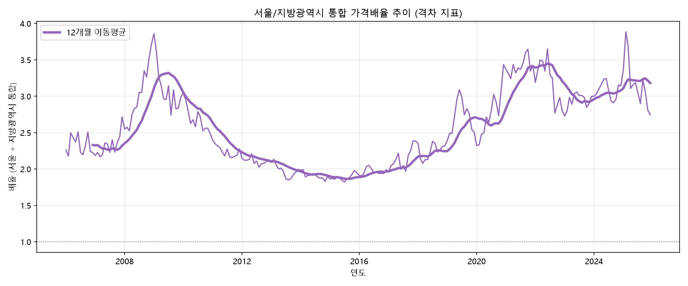
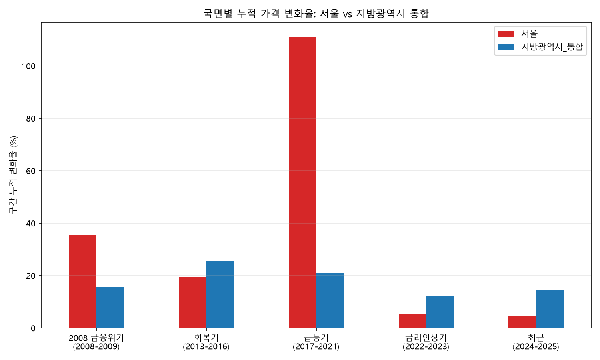
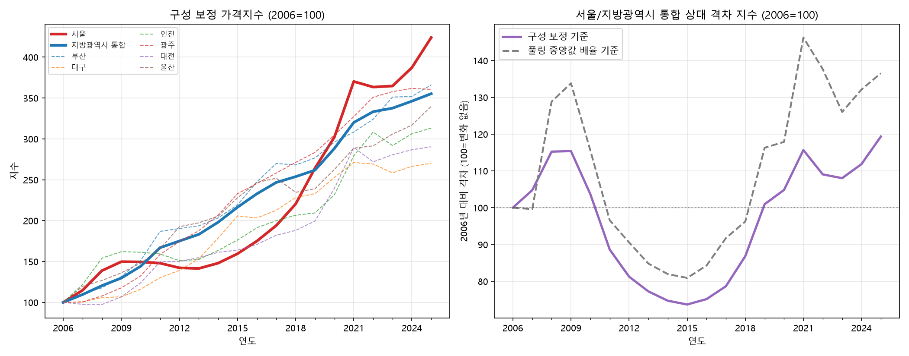
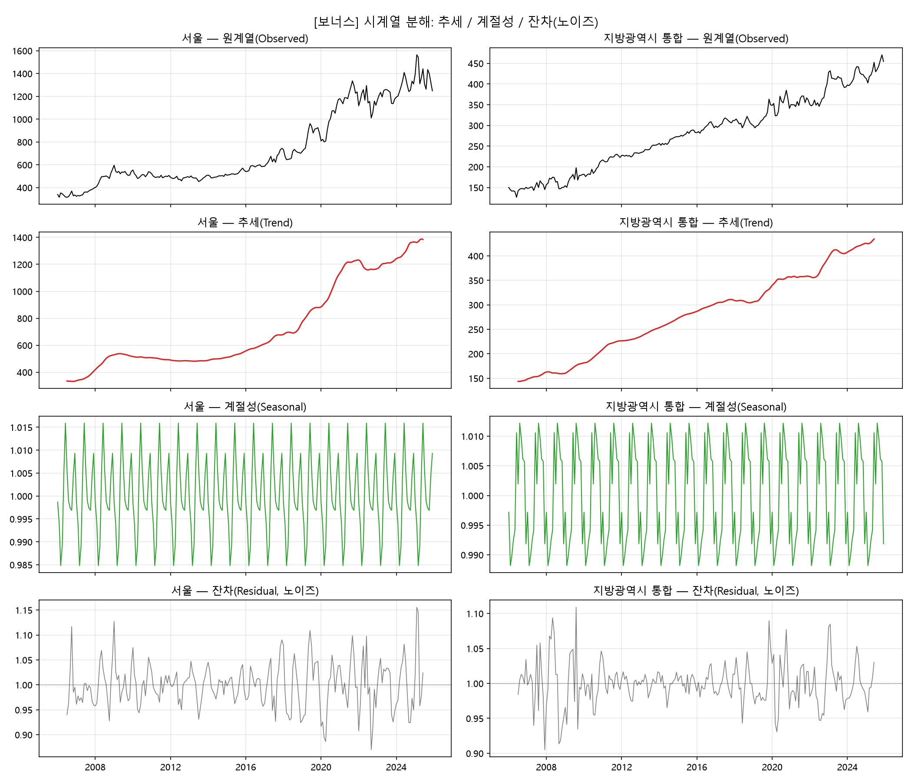

# 서울 vs 지방광역시 아파트 가격 격차 분석 (2006\~2025)

## 1. 분석 주제 및 선정 이유

- 원래 한국 가계 순자산 통계로 분석을 시작했으나, 해당 통계(KOSIS 가계금융복지조사)가 연 단위 저빈도 자료라 "최소 100개 이상 데이터 포인트" 요건을 충족하기 어려워 주제를 변경했다.
- 순자산 분석에서 다루려 했던 "부동산 비중" 가설을 이어받아, 국토교통부 아파트매매 실거래자료(고빈도·풍부한 데이터)를 활용해 **서울과 지방광역시 간 아파트 가격 격차**를 분석 주제로 선정했다.
- 수도권 집중, 지역균형발전은 최근 한국 사회의 핵심 이슈 중 하나이며, 실거래가 데이터로 그 흐름을 직접 확인해보고자 했다.

## 2. 분석 질문 (3개 이상)

1. 서울과 지방광역시 간 아파트 가격 격차는 지난 20년간 확대되었는가, 축소되었는가?
2. 격차가 가장 크게 벌어지거나 좁혀진 시기는 언제이며, 어떤 국면(금융위기·급등기·금리인상기 등)과 연결지어 볼 수 있는가?
3. 지방광역시 6개 도시 사이에도 가격 상승 속도 차이가 있는가? 서울과 가장 유사하게/다르게 움직인 도시는 어디인가?

## 3. 데이터 설명

- **출처**: 국토교통부 아파트매매 실거래자료 (공공데이터포털 Open API, `getRTMSDataSvcAptTrade`)
- **수집 범위**: 서울 25개구 + 부산 16 + 대구 9 + 인천 11 + 광주 5 + 대전 5 + 울산 5 = **전체 76개 지역**
- **기간**: 2006년 1월\~2025년 12월 (20년, 240개월) — 2006년 1월은 부동산 실거래가 신고 의무화 시행일로, API가 제공하는 최초 시점
- **원본 데이터 규모**: 4,632,458건 (개별 거래 단위)
- **원본 데이터 열람**: 460만 건 전체는 지역·월별 CSV로 나눠 저장소에 포함했다 ([`data/regional/`](data/regional/INDEX.md), 75개 구·군 17,878개 파일, 이상치 제거 전 값)
- **주요 컬럼**: 지역/도시(구·시), 계약년월, 단지명(aptNm), 건축년도(buildYear), 거래금액(dealAmount), 전용면적(excluUseAr), 층(floor), 법정동(umdNm), 거래유형(dealingGbn) 등 총 17개 컬럼
- **결측치**: 분석에 쓰는 거래금액·전용면적 컬럼의 결측·0 이하 값 0건 (단지동·해제일 등 부가 컬럼은 공백이 많으나 분석에 사용하지 않음). 다만 "거래가 없는 달"(인천 옹진군, 대구 군위군 등)은 결측이 아니라 실제 거래 부재로, API 재조회(`totalCount=0`)로 확인했다.
- **이상치 처리**: (지역, 연도) 그룹별로 면적당 단가(만원/㎡)의 IQR 1.5배를 벗어나는 거래 제거 → 87,225건(전체의 1.9%) 제거
- **최종 정제 데이터**: 4,545,233건
- **참고**: 2026년 7월 광주-전남 행정통합으로 광주 지역 법정동코드가 전면 교체됨을 확인하고, 신코드(12xxx)로 교정해 수집했다 (자세한 내용은 AI 사용 로그 참고)
- **라이선스**: 국토교통부 실거래자료는 공공데이터포털을 통해 공공누리(자유이용) 조건으로 제공되는 공개 데이터이며, 원자료에 개인식별정보(매수·매도자 성명 등)는 포함되어 있지 않다

### 가격 지표 정의
- 아파트는 면적이 제각각이라 거래금액을 그대로 비교하면 왜곡이 생긴다. 이를 보정하기 위해 **면적당 단가 = 거래금액 ÷ 전용면적 (만원/㎡)** 를 핵심 지표로 사용했다.
- 지역·월별 대표값은 **중앙값(median)** 을 사용했다 (부동산 가격은 고가 이상치에 평균이 쉽게 왜곡되므로).
- **수준 비교**(시각화 1·2)에는 월별 중앙값을, **변화율 비교**(시각화 3·4, 인사이트)에는 거래 구성(지역·면적·연식) 변화를 보정한 **구성 보정 지수**를 사용했다. 중앙값은 대형·신축 거래가 몰리는 해에 가격이 그대로여도 오르는 왜곡이 있어, 변화율은 지수로 보는 것이 더 정확하다(자세한 방법은 시각화 3 설명).
- 비교 시리즈는 총 8개: 서울 / 지방광역시_통합(6개 도시 거래 전체 풀링) / 부산 / 대구 / 인천 / 광주 / 대전 / 울산
- 최종 데이터 포인트: **8개 시리즈 × 240개월 = 1,920개** (요구조건 100개의 약 19배)

## 4. 분석 결과 및 시각화

### 시각화 1 — 서울 vs 지방광역시 면적당 가격 추이


원계열(연한 선)과 12개월 이동평균(굵은 선)을 함께 표시했다. 서울과 지방광역시 통합 간 격차가 시간이 지날수록 벌어지는 추세와, 2017년 이후 서울의 가파른 상승이 뚜렷하게 보인다.

### 시각화 2 — 서울/지방광역시 가격배율(격차 지표) 추이


서울 가격을 지방광역시 통합 가격으로 나눈 배율의 추이다. 배율이 오르면 격차가 커지는 것이고, 내리면 좁혀지는 것이다.

### 시각화 3 — 국면별 누적 가격 변화율 비교 (구성 보정)


2008 금융위기, 회복기(2013\~2016), 급등기(2017\~2021), 금리인상기(2022\~2023), 최근(2024\~2025) 5개 국면의 누적 변화율을 서울과 지방광역시 통합으로 비교했다(맨 위 그래프). 아래 두 그래프는 같은 구간을 세 가지 방식으로 계산한 결과다.

**산정 방식을 세 가지로 비교한 이유**: 처음에는 구간의 첫 달과 마지막 달 중앙값만 비교했는데, 서울이 금리인상기 +5.4%, 최근 +4.6%로 나와 실제 흐름(아래 시각화 4에서 2023년 이후 매년 상승)보다 낮게 보였고, 지방은 금리인상기에 +12.2%로 높게 나왔다. 점검 결과 두 가지 왜곡이 있었다.
1. **종점 문제**: 월별 중앙값은 크게 흔들린다(서울 2021년 10월 1,295 → 2022년 1월 1,117 → 2022년 6월 1,294만원/㎡). 시작·끝 달이 우연히 낮거나 높으면 변화율이 크게 달라진다. → 구간 끝 12월과 직전 해 12월의 **12개월 이동평균**을 비교한다.
2. **거래 구성 문제**: 가격이 그대로여도 어떤 해에 대형·신축 거래가 몰리면 ㎡당 중앙값이 오른다. 지방광역시 통합의 2022→2023 연평균 상승률은 풀링 중앙값으로 +14.0%지만 구성을 보정하면 +1.3%다(부산 +27.4% → +8.4%, 대구 +3.5% → -4.0%). → 지역(구·군)×면적대×연식대 칸별 중앙값을 인접 두 해의 거래 비중으로 가중해 연쇄한 **구성 보정 지수**를 만든다. 지수는 12개월(1년) 창 단위라 1번 문제도 함께 줄이므로 이 지수를 채택했다.

| 구간 | 시리즈 | 기존(첫 달→끝 달) | 12개월 이동평균 | 구성 보정 지수(채택) |
|---|---|---:|---:|---:|
| 금리인상기 2022\~2023 | 서울 | +5.4% | -0.8% | -1.5% |
| 금리인상기 2022\~2023 | 지방광역시 통합 | +12.2% | +15.2% | +5.5% |
| 최근 2024\~2025 | 서울 | +4.6% | +14.3% | +16.3% |
| 최근 2024\~2025 | 지방광역시 통합 | +14.3% | +5.8% | +5.2% |

전체 표는 [`period_comparison.csv`](data/processed/period_comparison.csv), 계산 과정과 커버리지(지수 계산에 쓰인 거래 비중 99.2% 이상)는 [`adjustment_diagnostics.txt`](data/processed/adjustment_diagnostics.txt)에 있다.

### 시각화 4 — 구성 보정 지수 경로와 격차 상대지수


왼쪽은 8개 시리즈의 구성 보정 가격지수(2006년=100), 오른쪽은 서울 지수를 지방광역시 통합 지수로 나눈 **상대 격차 지수**(2006년=100)를 시각화 2와 같은 방식의 풀링 중앙값 배율과 비교한 것이다. 이 지수는 "2006년에 비해 격차가 몇 % 벌어졌나"만 보여주며, "서울이 지방의 몇 배"라는 수준 비교는 시각화 1·2(중앙값)에서 한다.

## 5. 인사이트 (3개 이상)

### 인사이트 1 — 20년간 격차는 전반적으로 확대됐다
- **관찰**: 구성 보정 지수 기준으로 2006년 대비 2025년 서울은 +324.0%(지수 424), 지방광역시 통합은 +255.3%(지수 355) 올랐다. 서울/지방 상대 격차 지수는 2006년 100에서 2025년 119로, 서울이 지방 대비 2006년보다 19% 더 비싸졌다. 풀링 중앙값 배율(2006년 평균 2.33배 → 2025년 3.18배)로 보면 137로 나와 **격차 크기가 과대**해 보이는데, 구성 변화가 섞이기 때문이다. 방향(확대)은 두 방식이 같다.
- **원인(가설)**: 수도권 집중(인구·일자리·인프라)과 유동성 확대기 서울 중심의 투자수요 쏠림이 원인으로 추정된다. 다만 본 데이터에는 소득·인구이동 등 원인 변수가 포함되지 않아 가설 수준이며, 반례로 2013\~2016년 회복기(지방 +33.0% vs 서울 +23.1%)와 2022\~2023년 금리인상기(지방 +5.5% vs 서울 -1.5%)에는 지방이 서울보다 더 올랐다.
- **행동/제안**: 지역균형발전 정책 효과를 소득·인구 데이터와 함께 후속 분석할 필요가 있다.

### 인사이트 2 — 격차는 일방적 확대가 아니라 국면별로 출렁였다
- **관찰**: 상대 격차 지수(2006=100)는 2009년 115까지 올랐다가 2015년 74(전체 기간 최저)까지 좁혀졌고, 2021년 116으로 다시 벌어진 뒤 2022\~2023년에 108로 진정됐다가 2025년 119(전체 기간 최고)로 다시 커졌다. 2017\~2021년 급등기에는 서울이 +111.6% 오르는 동안 지방광역시 통합은 +37.5%였고, 2015년 74에서 2021년 116으로 격차가 57% 커졌다. 2022\~2023년에는 서울이 -1.5%로 보합·소폭 하락, 지방이 +5.5%였다. 2023년 이후 서울은 매년 올라(2024년 +6.2%, 2025년 +9.5%) 지방(+2.5%, +2.6%)과의 격차가 다시 벌어졌다.
- **해석(가설)**: 격차는 특정 국면(저금리·유동성 확대기)에 집중적으로 벌어지고, 금리 상승기에는 서울이 먼저 조정을 받으며 진정되는 패턴으로 보인다. 다만 원인은 본 데이터만으로 확인할 수 없다.
- **행동/제안**: 향후 금리 변화 국면에서 격차가 어떻게 움직이는지 추적할 가치가 있다.

### 인사이트 3 — "지방광역시"로 뭉뚱그리면 안 보이는 내부 격차가 있다
- **관찰**: 2006년 대비 2025년 구성 보정 상승률은 서울 +324.0%, 부산 +266.1%, 광주 +260.6%, 울산 +239.8%, 인천 +213.2%, 대전 +190.4%, 대구 +170.1% 순이었다(지방 6개 도시 사이 최대 96%p 차이). 오른 시기도 달랐다. 2013\~2016년 회복기에는 대구(+46.1%)·광주(+40.7%)가 서울(+23.1%)의 1.8\~2배 올랐고, 2017\~2021년 급등기에 서울이 +111.6%일 때 울산은 +17.0%, 부산은 +24.6%에 그쳤다. 2024\~2025년에는 서울 +16.3%, 울산 +11.1%, 나머지 도시는 +0.8\~+7.3%였다.
- **해석(가설)**: "지방광역시 통합"이라는 하나의 평균선은 도시마다 오른 시기가 다르다는 사실을 가린다. 서울이 급등하던 시기에 일부 지방 도시는 크게 뒤처졌으므로, 서울-지방 격차 확대는 서울의 급등과 지방 도시별 상승 시차가 겹친 결과일 수 있다. 다만 도시별 원인(산업 업황, 입주물량 등)은 본 데이터에 없어 검증하지 못했다.
- **행동/제안**: 지방 내부 격차의 원인(산업구조 변화, 인구 유출입, 신규 공급 등)을 도시별로 세분화해 분석할 필요가 있다.

## 6. 결론 및 한계점

### 결론
서울과 지방광역시 간 아파트 가격 격차는 2006년보다 커졌지만(상대 격차 지수 100 → 119) 일방적으로 확대된 것이 아니라 2009년 115 → 2015년 최저 74 → 2021년 116 → 2025년 최고 119로 국면에 따라 확대와 축소를 반복했고, 특히 2017\~2021년 급등기에 집중적으로 벌어졌다. 2022\~2023년 금리인상기에는 서울이 조정받아 격차가 진정됐으나, 2024\~2025년에는 서울(+16.3%)이 지방(+5.2%)보다 크게 올라 격차가 다시 벌어졌다. 또한 "지방광역시"를 하나로 묶기보다 도시별로 보면 20년 상승률(+170.1%\~+266.1%)과 오른 시기 모두 도시마다 크게 달랐다.

### 한계점
- 가격 지표는 면적당 단가(중앙값)이며, 층수·입지·브랜드 등 품질 차이는 반영하지 못했다.
- 변화율 비교에 쓴 구성 보정 지수는 (지역×면적대×연식대) 칸 정의에 의존하고, 연(12개월) 단위라 분기·월 단위의 국면 전환은 포착하지 못한다. 칸 정의를 바꿨을 때 결과가 얼마나 달라지는지(민감도)는 검증하지 않았다.
- 수준 비교용 시각화 1·2와 [보너스] 분해는 구성 변화가 섞인 월별 중앙값을 그대로 쓴다. 특히 시각화 2의 배율은 구성 보정 기준보다 격차를 크게 보여준다(2025년 상대 격차 137 vs 119).
- 수집 단계에서 해제(취소) 거래 표시(`cdealType`)를 저장하지 않아 취소된 거래를 제거하지 못했다. API 표본 조회에서 취소 표시 거래가 4.2\~10.7%였고(2025년 6월 서울 10.7%), 재수집 전에는 영향 크기를 확정할 수 없다.
- 이상치 제거(IQR, 지역×연도 단위)는 표준적 방법이지만, 일부 극단치가 여전히 통계에 영향을 줬을 가능성을 배제할 수 없다.
- "지방광역시_통합"은 성격이 서로 다른 6개 도시(수도권 인접 도시부터 산업도시까지)를 하나로 묶은 값으로, 내부 이질성을 평균 뒤에 감춘다 (인사이트 3에서 일부 보완).
- 2026년 7월 광주-전남 행정통합으로 광주 지역 법정동코드가 전면 교체되어, 수집 과정에서 신코드로 교정했다. 이 과정에서 일부 누락 가능성을 완전히 배제할 수 없다.
- 분석 기간은 2025년 12월까지로, 2026년 데이터는 신고 지연 때문에 포함하지 않았다.
- 소득, 인구이동, 금리, 정책 변수 등 가격에 영향을 줄 수 있는 외부 요인은 이번 분석에 포함되지 않았다 — 관찰된 상관관계를 인과관계로 해석하지 않도록 주의가 필요하다.

## 7. [보너스] 시계열 심화 — 추세/계절성 분해

**고전적 분해(이동평균 방식) + 승법(multiplicative) 모델**로 서울과 지방광역시 통합 시리즈를 **추세(Trend) / 계절성(Seasonal) / 잔차(Residual, 노이즈)** 로 분해했다. 가격 수준이 크게 올라 계절 변동폭도 수준에 비례할 가능성이 있어 승법을 택했고, 이 선택이 타당한지와 다른 분해 방식을 쓰면 결과가 어떻게 달라지는지는 아래 "분해 방식 선택 근거"에서 수치로 확인했다.



- **추세(Trend)**: 위 인사이트에서 다룬 장기 상승 흐름과 2017\~2021년 급등 구간이 붉은 선에서 뚜렷하게 재확인된다.
- **계절성(Seasonal)**: 서울은 6월에 계절적으로 가장 높고(계수 1.0159) 3월에 가장 낮았다(계수 0.9848, 진폭 3.11%p). 지방광역시 통합은 8월에 가장 높고(1.0122) 2월에 가장 낮았다(0.9882, 진폭 2.40%p). 진폭이 3%p 안팎으로 크지 않아, **가격 흐름은 계절성보다 추세가 압도적으로 지배**한다고 해석할 수 있다. 다만 서울의 "6월 최고·3월 최저"는 STL로 다시 분해하면 4월 최고·10월 최저로 달라지므로(아래 참고) 안정적인 계절 패턴으로 단정하지 않는다.
- **잔차(Residual, 노이즈)**: 추세·계절성으로 설명되지 않는 나머지 변동으로, 2008년 금융위기 직후나 2022\~2023년 금리인상기처럼 급격한 국면 전환 시점에 잔차가 크게 튀는 구간이 관찰된다. 이 잔차가 국면 전환기에 실제로 커지는 경향이 있는지는 별도 검증이 필요하며, 가설로는 정책·경제 충격이 반영됐을 가능성이 있다.
- **한계**: 계절 주기를 12개월로 고정했고, `statsmodels`의 이동평균 기반 분해는 양 끝 구간(2006년 초, 2025년 말) 추세값이 계산되지 않는 한계가 있다. 또한 분해 대상이 거래 구성 변화(면적·연식 비중 등)를 그대로 포함한 월별 중앙값이라, 계절성과 구성 변화가 섞여 있을 수 있다.

### 분해 방식 선택 근거

분해 방식은 ① 성분을 어떻게 결합할지(가법 vs 승법)와 ② 성분을 어떻게 추정할지(고전적 이동평균, STL, X-11, SEATS)를 각각 정해야 한다. 아래 수치는 [`scripts/decompose_compare.py`](scripts/decompose_compare.py)로 계산했고 결과는 [`decomposition_method_comparison.txt`](data/processed/decomposition_method_comparison.txt), [`seasonal_method_comparison.csv`](data/processed/seasonal_method_comparison.csv)에 있다.

**① 가법 vs 승법 — 승법 채택**
- 가법은 계절 변동폭이 가격 수준과 무관하게 일정할 때, 승법은 수준에 비례해 커질 때 적합하다.
- 2007\~2012년 대비 2019\~2024년 추세 수준은 서울 ×2.34, 지방광역시 통합 ×1.97 상승했다. **지방**은 추세 대비 편차의 절대 크기가 ×1.93으로 수준 상승과 거의 같고 상대 크기는 ×0.89로 일정해 승법과 잘 맞는다. **서울**은 절대 크기 ×3.63, 상대 크기 ×1.64로 둘 다 커졌지만 상대 쪽이 덜 커져 가법보다 승법이 덜 어긋난다. 다만 서울은 수준 상승보다 변동성이 더 커져 승법으로도 완전히 설명되지 않는다.
- 잔차의 상대 표준편차는 가법과 승법이 거의 같았다(서울 후기 5.40% vs 5.48%, 지방 후기 3.33% vs 3.36%). 즉 어느 쪽을 써도 잔차 크기와 결론이 크게 달라지지 않는다. 승법을 택한 이유는 수치가 압도적으로 우월해서가 아니라, 지방에서 근거가 뚜렷하고 서울에서도 가법보다 덜 어긋나며, 계절 계수를 "%"로 읽을 수 있어 가격 해석에 자연스럽기 때문이다. (로그 변환 후 가법 분해는 승법과 같은 구조다.)

**② 추정 방법 — 고전적 분해 채택, STL로 교차 확인**

| 방식 | 특징 | 본 분석에서의 판단 |
|---|---|---|
| 고전적 분해 (채택) | 12개월 중심 이동평균으로 추세, 월별 평균으로 계절 계수를 구함 | 계산 과정이 단순·투명해 "왜/어떻게"를 설명하기 쉽고 튜닝 파라미터가 없어 재현이 쉽다. 단점: 양 끝 6개월씩 추세가 없고(240개월 중 228개월), 계절 패턴이 매년 같다고 가정하며 이상치에 민감하다. |
| STL | LOESS 기반. 계절 패턴이 서서히 변해도 되고 로버스트 옵션으로 이상치 영향을 줄이며 끝 구간도 추정(240개월 전부) | 로그 변환 후 로버스트 STL로 교차 실행. 지방은 월별 계절 계수 상관 0.918로 고전적 결과와 대체로 일치(최고·최저월 8·2월 vs 9·12월). 서울은 상관 -0.624, 최고·최저월이 6·3월 vs 4·10월로 달랐고 연도별 계절 진폭도 2.86\~21.73%p로 들쑥날쑥해, 서울의 계절 패턴은 방법에 민감하다. |
| X-11 | 헨더슨 필터 이동평균을 반복하는 미국 센서스국 방식 | X-13ARIMA-SEATS 실행파일이 이 환경에 없어 **실행하지 못했다**. 거래일·휴일 효과 보정이 강점인데 본 시리즈(월별 중앙값 240개)에는 달력 효과가 없어 이점이 작다고 판단했다. 성능 우열은 주장하지 않는다. |
| SEATS | ARIMA 모형 기반 신호 추출 | 위와 같은 이유로 실행하지 못했다. ARIMA 사전 모형화가 필요해 과제 범위를 넘어선다고 판단했다. |

- **결론**: 추세가 계절성보다 압도적이라는 결론은 방식과 무관하게 유지된다(계절 진폭 3%p대 vs 추세 수준 2배 안팎 상승). 반면 서울의 구체적 계절 패턴(6월 최고·3월 최저)은 방식에 따라 달라지므로 해석을 유보한다. 서울의 계절 진폭(3.11%p)은 잔차의 변동(상대 표준편차 3\~5%)과 비슷한 크기여서, 계절성이 존재한다고 보기도 어렵다.

## 8. AI 사용 로그

| 사용 작업 | 사용 이유 | 검증 방법 |
|---|---|---|
| 국토교통부 API 파라미터/엔드포인트 설계 및 수집 스크립트 작성 | 공공데이터포털 API 문서를 빠르게 코드로 전환하기 위해 | 지역별 1건씩 시험 호출해 `resultCode=000`과 응답 필드를 확인하고, 수집 후 18,240개 지역×월 조합 중 확보된 조합 수를 원본 CSV에서 다시 집계해 대조 |
| 2026년 7월 광주-전남 행정통합에 따른 지역코드 변경 여부 조사 | 옛 광주 코드로 조회 시 여러 구·여러 연도에서 일괄 0건이 나온 원인을 규명하기 위해 | 웹검색으로 개편 사실을 1차 확인 후, 국토부 실거래가 사이트의 지역 선택 목록에서 새 코드(12xxx)를 직접 확인하고, 신코드로 2020·2025년 데이터가 조회되는지 API로 재검증 |
| 일부 "0건" 구간(인천 옹진군, 대구 군위군 등)의 원인 판별 | 수집 실패인지 실제 거래 부재인지 구분하기 위해 | 해당 지역·월을 API에 직접 재요청해 `resultCode=000, totalCount=0`(정상 응답)임을 확인. 진짜 누락(SSL 오류)이었던 대구 동구 2023년 3월은 재수집 |
| 수집·전처리 스크립트의 오류 수정 | AI가 작성한 코드가 그대로 동작하지 않아 원인을 찾기 위해 | 한도 초과(HTTP 429) 이후에도 수집이 멈추지 않던 문제는 실행 로그에서, pandas `groupby.apply`가 컬럼을 유실하던 문제는 에러 메시지에서 확인해 수정하고 재실행 결과(행 수·시리즈 수)를 다시 점검 |
| 전처리·시계열 분석·시각화 코드 작성 | 대용량(460만 건) 데이터의 정제·집계·시각화를 효율적으로 처리하기 위해 | 전처리 로그(원본/제거/최종 행 수, 시리즈 8개×240개월=1,920개)를 예상치와 대조하고, 생성된 이미지를 직접 열어 축·범례·한글 표시를 확인 |
| 시각화 3 결과가 이상하다는 지적에 대한 원인 진단과 구성 보정 지수 설계 | 결과가 실제 흐름과 다르다는 문제 제기를 받아, 데이터 오류인지 지표 설계 문제인지 가려내기 위해 | 원본을 직접 재집계해 종점 민감도와 거래 구성 변화(면적·연식·지역 비중)를 확인하고, API를 표본 조회해 취소 거래 비중을 측정. 구성 보정 지수는 지수 계산에 쓰인 거래 비중(99.2% 이상), 풀링 중앙값과의 차이(부산 +27.4% → +8.4% 등)를 대조해 검증 |
| 시계열 분해 방식(승법·고전적 분해) 선택 | 처음에는 "가격 수준이 오르면 변동폭도 커질 것"이라는 가정으로 승법을 택했고, 그 가정을 확인하기 위해 | 가법/승법의 규모 의존성과 잔차 크기를 계산하고 STL로 교차 실행(`scripts/decompose_compare.py`). 서울의 계절 패턴이 방법에 따라 달라지는 것을 확인해 기존의 단정적 해석을 유보로 수정 |
| 인사이트(관찰-해석-행동) 작성 | 대량의 수치에서 패턴을 빠르게 정리하기 위해 | 인사이트의 수치를 `key_stats.txt`, `period_comparison.csv`, `gap_ratio_monthly.csv`와 대조. 이 과정에서 오기 수치, 단월 비교 때문에 울산이 서울보다 더 오른 것으로 잘못 나왔던 결론, 거래 구성 변화로 지방 상승률이 과대평가된 문제를 차례로 발견해 지표를 구성 보정 지수로 바꾸고 인사이트를 다시 작성 |

## 9. 재현 방법

```bash
pip install -r requirements.txt
```

`.env` 파일에 `MOLIT_API_KEY=발급받은키`를 넣은 뒤:

```bash
python scripts/collect_data.py   # 원본 데이터 수집 (일일 트래픽 한도로 여러 날 나눠 실행될 수 있음)
python scripts/split_by_region_month.py   # (선택) 원본을 지역별·월별 CSV로 분할 -> data/regional/
python scripts/preprocess.py     # 정제 + 8개 시리즈 월별 집계
python scripts/analyze.py        # 이동평균·격차 배율 + 시각화 1·2 생성
python scripts/composition_index.py   # 구성 보정 지수 + 국면별 변화율 + 시각화 3·4 (analyze.py 다음에 실행)
python scripts/decompose.py      # [보너스] 추세/계절성 분해 + 시각화 1종 생성
python scripts/decompose_compare.py   # [보너스] 분해 방식(가법/승법, 고전적/STL) 비교 수치 생성
```

## 10. 보완하지 않은 부분에 대한 코멘트

- **해제(취소) 거래를 제거하지 않은 이유**: 제거하려면 취소 표시 필드를 포함해 76개 지역×240개월을 다시 수집해야 하고, 공공데이터포털 일일 호출 한도(1만 건) 때문에 1\~2일이 더 걸린다. API 표본 조회에서 취소 표시 거래는 4.2\~10.7%였다. 취소 거래가 특정 가격대에 몰렸는지는 확인하지 못했지만 비중이 크지 않아 중앙값이 크게 흔들릴 가능성은 낮다고 판단했다(검증하지 못한 판단이며, 한계점에 명시했다).
- **시각화 1·2와 [보너스] 분해를 중앙값 그대로 둔 이유**: 이 분석들은 월 단위 시계열(원계열, 이동평균, 12개월 주기 계절성)이 필요한데 구성 보정 지수는 연 단위라 대체할 수 없고, 시각화 1·2는 "서울이 지방의 몇 배인가"라는 수준을 보여주는 것이 목적이다. 격차가 확대됐는지와 변화율은 구성 보정 지수로 교차 검증했고 방향이 같아 결론은 유지된다. 다만 배율의 크기는 과대하게 나온다는 점(2025년 상대 격차 137 vs 119)과 서울의 계절 패턴이 방법에 따라 달라진다는 점은 각각 한계점과 7번 섹션에 밝혀 두었다.
